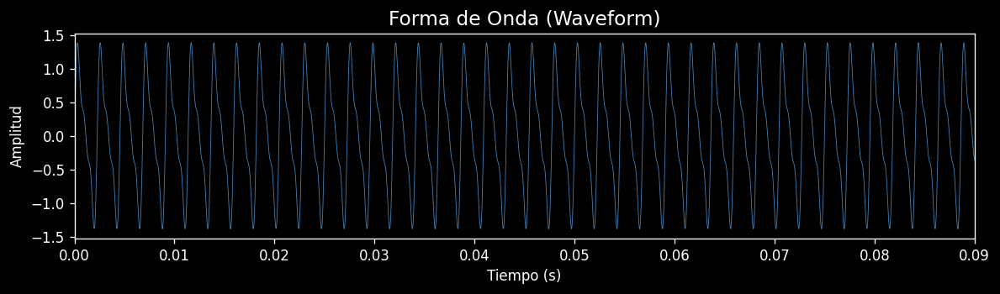
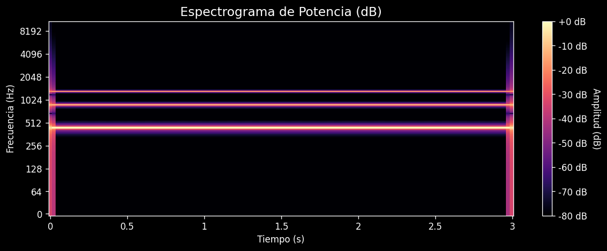
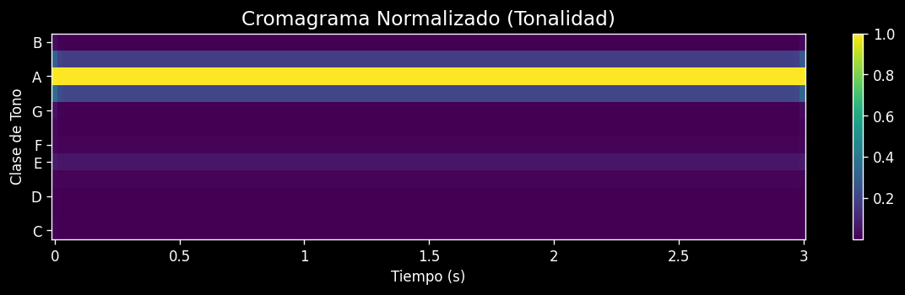

# Analizador de Música DSP


Aplicación de escritorio para análisis de audio mediante Procesamiento Digital de Señales (DSP). Extrae características musicales como **BPM** y **tonalidad**, y genera visualizaciones de **espectrogramas**, **cromagramas** y **forma de onda**.



## Características

- **Análisis de Tempo (BPM)**: Detección automática del tempo musical
- **Detección de Tonalidad**: Identifica la clave musical (Mayor/Menor) usando el algoritmo Krumhansl-Schmuckler
- **Espectrograma de Potencia**: Visualización frecuencia-tiempo en escala logarítmica
- **Cromagrama**: Representación visual de la distribución de clases de tonos
- **Forma de Onda**: Visualización temporal de la señal de audio
- **Historial de Análisis**: Navegación entre tracks analizados previamente
- **Exportación de resultados**: Guarda análisis en formato JSON o CSV
- **Procesamiento en segundo plano**: La UI nunca se congela gracias a QThread
- **Drag & Drop**: Arrastrá archivos de audio directamente a la ventana
- **Análisis por lotes**: Procesá múltiples archivos en secuencia
- **Interfaz Gráfica Moderna**: Construida con PySide6 (Qt for Python)
- **Arquitectura MVC**: Modelo-Vista-Controlador con signals/slots

## Demostración

### Visualizaciones generadas

Cada análisis produce tres visualizaciones interactivas (con zoom y pan):

| Espectrograma | Cromagrama |
|:---:|:---:|
|  |  |

| Waveform |
|:---:|
|  |

### Flujo de uso

```
1. Clic en "Cargar y Analizar Audio..." (o arrastrá un archivo)
       │
       ▼
2. Barra de progreso muestra el avance del análisis
       │
       ▼
3. Resultados escalares: BPM, Tonalidad
       │
       ▼
4. Visualizaciones: Waveform → Espectrograma → Cromagrama
       │
       ▼
5. Exportá a JSON/CSV o navegá el historial
```

## Tecnologías

| Tecnología | Versión mínima | Propósito |
|-----------|---------------|-----------|
| Python | 3.10+ | Lenguaje base |
| PySide6 | 6.5.0 | Framework de interfaz gráfica |
| librosa | 0.9.0 | Análisis de audio y música |
| NumPy | 1.21.0 | Computación numérica |
| Matplotlib | 3.5.0 | Visualización de datos |
| SciPy | 1.7.0 | Generación de señales de prueba |
| pytest | — | Testing automatizado |
| ruff | — | Linter y formateador |
| mypy | — | Type checker estático |

## Instalación

```bash
# 1. Clonar
git clone https://github.com/IdkHexa/Analizador-de-canciones-DSP.git
cd music-analyzer

# 2. Crear entorno virtual (recomendado)
python -m venv venv

# Windows
venv\Scripts\activate
# Linux/Mac
source venv/bin/activate

# 3. Instalar dependencias
pip install -r requirements.txt
```

## Uso

```bash
python main.py
```

Pasos para analizar audio:

1. Click en **"Cargar y Analizar Audio..."**
2. Seleccioná un archivo de audio (MP3, WAV, FLAC)
3. Esperá a que se complete el análisis
4. Visualizá los resultados:
   - **Panel izquierdo**: BPM, Tonalidad, historial de análisis
   - **Panel derecho**: Espectrograma y Cromagrama interactivos
5. Clickeá cualquier entrada del historial para restaurar análisis previos

## Estructura del Proyecto

```
music-analyzer/
│
├── main.py                              # Punto de entrada
├── pyproject.toml                       # Packaging y tool config
├── .pre-commit-config.yaml              # Hooks de ruff, black, mypy
├── requirements.txt                     # Dependencias del proyecto
├── README.md                            # Este archivo
│
├── src/
│   ├── config/                          # Configuración centralizada
│   │   └── __init__.py                  # Constantes DSP, estilos UI, settings
│   │
│   ├── model/                           # Capa de Modelo (lógica de negocio)
│   │   ├── __init__.py
│   │   ├── audio_file.py               # Encapsulamiento de datos de audio
│   │   ├── feature_extractor.py        # Extracción de características DSP
│   │   └── playlist_analyzer.py        # Análisis agregado de playlists
│   │
│   ├── view/                            # Capa de Vista (interfaz gráfica)
│   │   ├── __init__.py
│   │   ├── main_window.py              # Ventana principal con historial
│   │   └── visualizer.py               # Visualizadores Matplotlib
│   │
│   └── controller/                      # Capa de Controlador (orquestación)
│       ├── __init__.py
│       └── main_controller.py           # WorkerObject + QThread + historial
│
├── tests/                               # Tests automatizados
│   ├── conftest.py                      # Fixtures compartidos
│   ├── fixtures/
│   │   ├── generate_wav.py             # Generador de WAV sintético
│   │   └── sine_440.wav                # WAV de prueba (440 Hz, 2s)
│   ├── test_audio_file.py              # Tests de AudioFile (mocked)
│   ├── test_feature_extractor.py       # Tests de detección de key + pipeline
│   ├── test_integration.py             # Tests end-to-end con WAV real
│   └── test_results.py                 # Tests de SingleTrackResult y aggregates
│
└── .github/workflows/
    └── ci.yml                           # CI matrix (3.10, 3.11, 3.12)
```

## Testing y Calidad

```bash
# Tests
pytest                     # 22 tests, 0 fallos esperados

# Linter
ruff check src/ tests/     # 0 errores

# Formateo
ruff format --check src/ tests/

# Type checking
mypy src/                  # Success: no issues found

# Pre-commit (opcional)
pre-commit install
pre-commit run --all-files
```

El proyecto corre **CI automatizado** en GitHub Actions para Python 3.10, 3.11 y 3.12 en cada push y PR.

## Principios de Ingeniería Implementados

### Patrón MVC (Model-View-Controller)
- **Model**: Lógica de negocio y procesamiento DSP
- **View**: Interfaz gráfica PySide6 con signals
- **Controller**: Orquestación y comunicación via QThread + signals/slots

### Programación Orientada a Objetos
- **Encapsulamiento**: `AudioFile` protege `_y` y `_sr` con getters
- **Abstracción**: `FeatureExtractor` oculta la complejidad de librosa
- **Herencia**: `BaseVisualizer → SpectrogramVisualizer, KeyVisualizer`
- **Polimorfismo**: `draw_data()` implementado de forma diferente en cada visualizador

### Buenas Prácticas
- ✅ **Type hints** en toda la codebase (verificados con mypy)
- ✅ **Google-style docstrings** en todas las clases y métodos públicos
- ✅ **Logging estructurado** en vez de print()
- ✅ **QThread** para operaciones async (no bloquea la UI)
- ✅ **Config centralizada** (src/config/) sin constantes hardcodeadas
- ✅ **22 tests automatizados** (unitarios + integración)
- ✅ **CI/CD** con GitHub Actions
- ✅ **Pre-commit hooks** (ruff, black, mypy)
- ✅ **Packaging moderno** (pyproject.toml)

## Algoritmos DSP Utilizados

### Detección de Tempo
Usa `librosa.feature.rhythm.tempo` con análisis de onset y autocorrelación.

### Detección de Tonalidad
Implementa el **algoritmo Krumhansl-Schmuckler**:

1. Extrae características cromáticas con STFT
2. Calcula vector promedio de 12 clases de tonos
3. Correlaciona con plantillas Mayor/Menor rotadas
4. Selecciona la clave con mayor correlación

### Espectrograma de Potencia
STFT (Short-Time Fourier Transform) convertida a escala de decibelios con `librosa.amplitude_to_db`.

## Troubleshooting

| Error | Solución |
|-------|----------|
| `ModuleNotFoundError: No module named 'librosa'` | `pip install -r requirements.txt` |
| `FutureWarning: librosa.beat.tempo` | Inocuo — el código usa try/except para ambas API |
| Audio no se carga | Verificar formato (MP3, WAV, FLAC) y que `soundfile` esté instalado |

## Ejemplos de Salida

```
Archivo: cancion.mp3
BPM: 120.00
Key: C Mayor
```

- **Espectrograma**: Distribución de energía en frecuencias a lo largo del tiempo
- **Cromagrama**: Distribución de las 12 clases de tonos (C, C#, D, ..., B)

## Autor

Desarrollado como proyecto educativo para demostrar conceptos de:

- Programación Orientada a Objetos
- Arquitectura MVC
- Procesamiento Digital de Señales
- Testing automatizado y CI/CD
- Desarrollo de aplicaciones GUI con Python

## Referencias

- [librosa](https://librosa.org/doc/latest/index.html)
- [PySide6](https://doc.qt.io/qtforpython-6/)
- [Krumhansl-Schmuckler key-finding](https://rnhart.net/articles/key-finding/)
- [The Scientist and Engineer's Guide to DSP](https://www.dspguide.com/)
